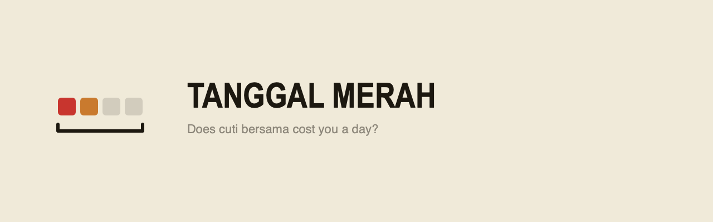
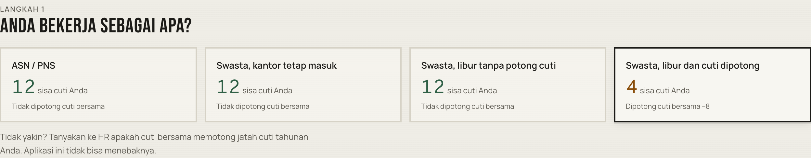
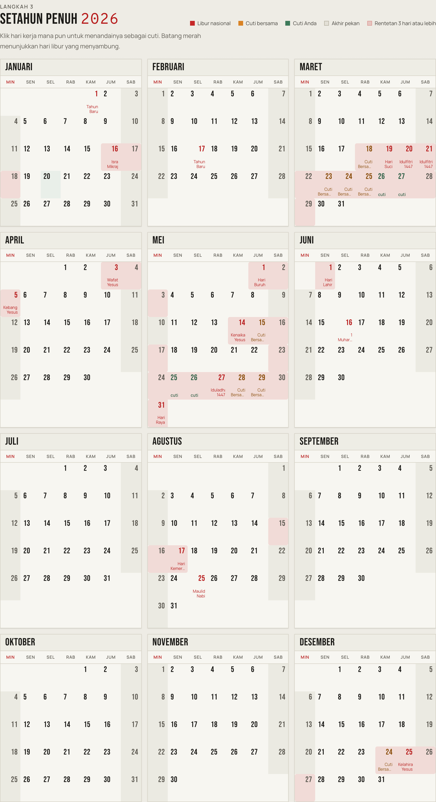

<div align="center">



### Libur nasional dan cuti bersama Indonesia — dan di mana cuti tahunan Anda paling berguna

**[Buka aplikasinya →](https://andifathulms.github.io/tanggal-merah/)**

[](https://github.com/andifathulms/tanggal-merah/actions/workflows/deploy.yml)


</div>

---

> **Aturan yang paling sering salah dipahami, dibuat eksplisit: apakah cuti bersama memotong jatah cuti tahunan Anda.**

Empat orang dengan jatah cuti yang sama persis bisa punya sisa yang sangat berbeda. Itu bukan bug — itu isi aturannya, dan aplikasi ini menunjukkannya di muka:

<div align="center">

</div>

*Tiga kartu menyisakan 12 hari. Satu menyisakan 4. Itulah keseluruhan intinya.*

<details>
<summary><b>In English</b></summary>

<br>

Indonesian public-holiday and leave planner. Ships cited SKB data per year, never computes a religious date, and refuses rather than projects for years with no published decree. Given your employment status and leave budget, it finds the exact set of bridge days that produce the longest stretches off — verified against a brute-force oracle, not a greedy heuristic.

The rule it exists to correct: for many private-sector workers, *cuti bersama* (joint leave) is deducted from annual leave, while for civil servants it is not. Published sources contradict each other on which is which, so the disagreement is recorded in a contradiction ledger rather than silently resolved.

Static site, GitHub Pages, no backend, no runtime network. Indonesian-first UI, English secondary.

</details>

---

## Kenapa ini tidak sesepele daftar tanggal

Daftar hari liburnya mudah. Dua hal tidak.

**Cuti bersama tidak gratis, dan aturannya berbeda menurut siapa Anda.** SKB menyatakan cuti bersama mengurangi hak cuti tahunan pekerja, dan bahwa bagi lembaga swasta pelaksanaannya diserahkan kepada masing-masing manajemen — jadi bagi pekerja swasta ia bersifat **fakultatif dan berbiaya**. Sementara itu Keppres mengatur bahwa bagi ASN cuti bersama **tidak** memotong cuti tahunan. Aplikasi ini menanyakan status Anda dan menyebut instrumen untuk setiap cabangnya.

**Sumber-sumbernya saling bertentangan, secara terbuka.** Pemberitaan atas SKB 2026 pernah membalik penetapan ASN dan swasta. Ketimbang diam-diam memilih, aplikasi ini mencatat semua bacaan beserta sumbernya di [catatan kontradiksi](data/contradictions/), lalu menyitasi ke **instrumen**, bukan ke pemberitaan. Validator menolak entri yang diselesaikan dengan memakai pemberitaan padahal ada bacaan bersumber instrumen.

## Hari libur ditetapkan, bukan dihitung

Idulfitri, Nyepi, Waisak, dan Imlek punya dasar astronomis atau kalendris — tetapi **hari libur resminya adalah apa yang ditetapkan SKB**, dan SKB sendiri menyerahkan penetapan 1 Ramadan, Idulfitri, serta Iduladha kepada Kementerian Agama.

Karena itu aplikasi ini mengirim data SKB per tahun dan **tidak pernah menghitung tanggal keagamaan**. Tidak ada hisab, konversi Hijriah, atau aritmetika kalender Saka di mana pun dalam kode ini. Tahun tanpa SKB terbit menghasilkan **penolakan terstruktur**, bukan proyeksi.

> Salah dengan percaya diri soal apakah seseorang libur atau tidak adalah satu-satunya kegagalan yang benar-benar penting di sini.

## Optimisasi yang eksak

Setiap kandidat hari cuti adalah **jembatan** — hari kerja yang terjepit di antara dua blok hari libur. Metriknya **leverage**: hari libur berturut-turut yang didapat per hari cuti yang dibelanjakan.

Optimisernya **eksak**, bukan greedy. Jembatan bisa beruntun: menutup dua celah berurutan menyambung tiga blok menjadi satu rentetan, dan itulah yang membuat pendekatan serakah salah. Hasilnya dicocokkan dengan pencarian menyeluruh ([`lib/optimise/brute.ts`](lib/optimise/brute.ts), khusus pengujian) di setiap anggaran yang realistis.

<div align="center">

</div>

*Rentetan hari libur digambar sebagai batang yang menyambung. Satu hari cuti yang tepat bukan satu kotak merah — ia adalah hal yang menyatukan dua blok menjadi satu rentetan.*

## ⚠️ Status data

> **`data/skb/2026.json` masih berstatus `perluVerifikasi`.**
>
> Tanggalnya disusun dari kalender 2026 yang beredar luas, tetapi **nomor SKB dan Keppresnya belum dicocokkan dengan dokumen terbitan**. Selama status itu belum berubah, aplikasi menampilkan banner peringatan di setiap halaman dan menuliskan sitasinya apa adanya sebagai `BELUM DIVERIFIKASI`.
>
> Nomor instrumen tidak pernah dikarang. Daftar yang harus dicek ada di **[UPDATING.md](UPDATING.md)**.

Validator memberi peringatan untuk pack draf, dan **menolak** pack yang mengaku `terverifikasi` sementara sitasinya masih placeholder.

## Fitur

| | |
|---|---|
| 📅 **Year sheet** | Dua belas bulan dalam tata letak kalender dinding, rentetan libur sebagai batang menyambung |
| 👤 **Status kepegawaian** | Empat cabang, tiga di antaranya sektor swasta — masing-masing menyebut instrumennya |
| 🗓️ **Pola kerja** | Lima hari atau enam hari. Sabtu tidak pernah diasumsikan libur |
| 🎯 **Usulan berperingkat** | Jembatan diurutkan menurut leverage, dengan aritmetikanya terlihat |
| 🧾 **Neraca cuti** | Jatah, potongan, pemakaian, sisa — beserta dasar dan sitasinya |
| 📤 **Ekspor** | ICS untuk kalender Anda, PNG untuk dibagikan, dan tautan berisi pilihan Anda |
| 📱 **PWA** | Bisa dipasang di layar utama, dan tetap jalan tanpa koneksi setelah muat pertama |
| 🌐 **Dwibahasa** | Indonesia (bawaan) dan Inggris |

## Perintah

```bash
pnpm dev                    # pengembangan
pnpm build                  # ekspor statis ke ./out; rules:validate jalan lebih dulu
pnpm preview                # menyajikan ./out di basePath produksi
pnpm test:run               # vitest sekali — sebelum setiap commit
pnpm test:optimiser         # kesepakatan dengan brute force + properti
pnpm test:status            # fixture ASN vs swasta, dua arah
pnpm rules:validate         # sitasi SKB, kontinuitas tanggal, tidak ada tanggal terhitung
pnpm typecheck
pnpm lint
```

`pnpm rules:validate` menggerbangi build dan CI — pack yang gagal menghentikan deploy sebelum apa pun dikerjakan.

## Struktur

```
app/[locale]/{tahun,rencana,aturan}   # id (bawaan), en
components/{sheet,ledger,suggest}
lib/
  day/        integer day numbers, aritmetika minggu. Tanpa Date.
  rules/      skema, loader, resolver, validator, penolakan
  status/     cabang hak cuti ASN vs swasta
  runs/       blok hari libur berturut-turut
  optimise/   enumerasi jembatan + seleksi eksak (brute.ts: khusus tes)
  sheet/      aritmetika grid dan geometri batang rentetan
  trace/      LeaveTrace
  export/     ICS + PNG
data/skb/               satu berkas per tahun, bersitasi
data/contradictions/    bacaan yang bertentangan beserta sumbernya
```

**Invarian yang menjelaskan bentuk kodenya:**

- Tidak ada objek `Date` di `lib/` — hari adalah bilangan bulat, jadi tidak ada zona waktu atau DST yang bisa menggeser hari libur
- Mesinnya tidak pernah membaca jam; tahun selalu argumen eksplisit
- `liburNasional` dan `cutiBersama` adalah dua tipe berbeda, dari data sampai UI — keduanya berbeda biaya
- Tidak ada yang dihitung di dalam komponen
- `brute.ts` tidak pernah diimpor di luar pengujian

## Menambah tahun

Baca **[UPDATING.md](UPDATING.md)**. Ringkasnya: transkripsikan dari dokumen SKB, jangan dari pemberitaan; jangan pernah menghitung tanggal hari raya; tahun tanpa SKB dibiarkan kosong; dan jangan melemahkan validator supaya data lolos.

## Merek

Marka "Jembatan" adalah tesis aplikasinya sendiri: satu sel merah (libur nasional), satu sel jingga (cuti bersama), dan akhir pekan yang tersambung, dengan kurung di bawahnya menghitung rentetan.

Merah selalu libur nasional, jingga selalu cuti bersama — tidak pernah ditukar atau dipakai sebagai hiasan. Aturan lengkapnya ada di [`public/brand/BRAND.txt`](public/brand/BRAND.txt).

## Penafian

Proyek pribadi, **bukan nasihat hukum ketenagakerjaan**. Di sektor swasta, kebijakan perusahaan yang menentukan pelaksanaan cuti bersama — pastikan ke HR Anda. Setiap tanggal di sini menyebut SKB asalnya sehingga Anda bisa memeriksanya sendiri.

<div align="center">
<sub>Dibuat oleh <a href="https://github.com/andifathulms">Andi Fathul Mukminin Salahuddin</a></sub>
</div>
